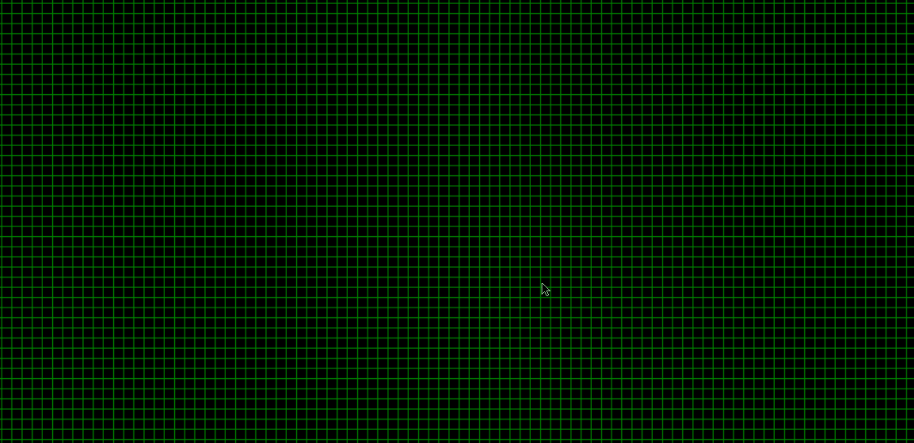

# The game of life
Conway's Game of Life. Implemented using pygame library.

# How to
Add cells using by clicking (or clicking and holding) LEFT MOUSE BUTTON.
Discard life cells by clicking (or clicking and holding) RIGHT MOUSE BUTTON.
Press RANDOM KEY to start the game.

